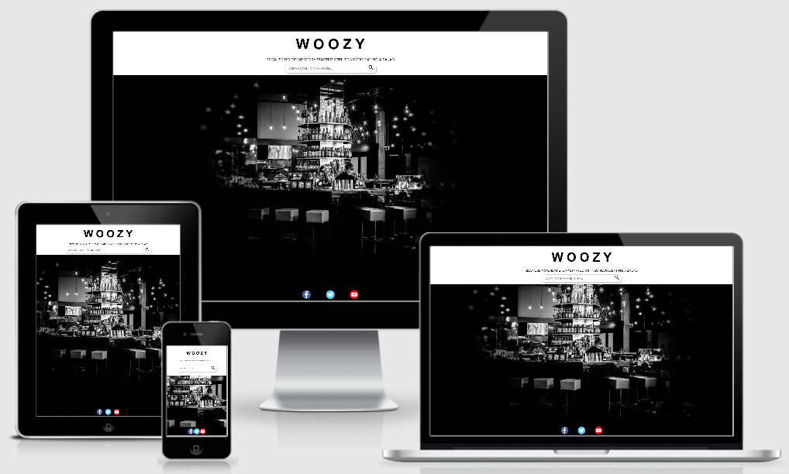

# Woozy
Cocktail search engine.

## Description
Woozy offers a wide variety of cocktail drink recipes at the touch of your fingertips! With Woozy users can search various easy to make cocktail recipes by alcohol name.

## Technologies
* HTML
* CSS
* JQuery

## Application Programming Interface (API)
The Cocktail DB via [rapidapi.com](https://rapidapi.com/theapiguy/api/the-cocktail-db/endpoints)
* Search ingredient by name
* Lookup full cocktail details by ID

## Approach

## Challenges
* **API Connection:** Woozy runs with the Cocktail DB (via Rapid API), however, the API requires the connection of different end-points to create a valuable user experience.

**Main Struggle:** Getting the recipe end-point to recognize the cocktail IDs without requesting a new key. 

* **Array Concatenation:** 
The data from the Cocktail DB is organized in various arrays i.e. Cocktail Measurement is one array and Cocktail Ingredient is another array.  To be able to show the cocktail  ingredients I needed to concatenate both arrays 

**Main Struggle:** I was able to concatenate both arrays but I received "undefined" when the measurement and ingredient arrays per drink were not the same length.

## Improvements

## Live Site
https://g-luperamirez.github.io/WoozyApp/

**Note** Site functionality on Safari is tricky.

**Responsiveness:**  

## Author
Guadalupe Ramirez

## Contributors
* Brian Carroll
* Joem Casusi
* Manny Santana

